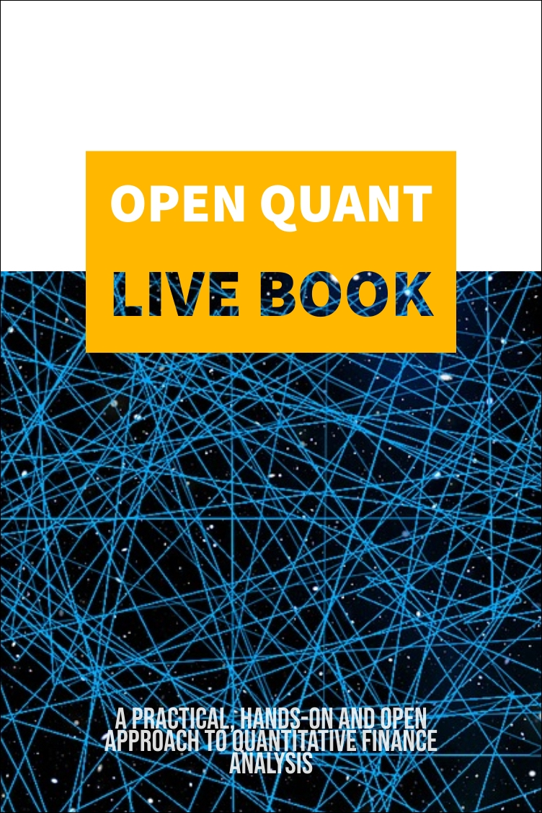

## The Open Quant Live Book Initiative

### Description

The book aims to be an Open Source introductory reference of the most important aspects of financial data analysis, algo trading, portfolio selection, econophysics and machine learning in finance with an emphasis in reproducibility and openness not to be found in most other typical Wall Street-like references.

### Contribute

The Book is Open and we welcome co-authors. Feel free to [reach out](https://www.openquants.com/contact) or simply create a pull request with your contribution! See project structure, guidelines and how to contribute [here](https://github.com/souzatharsis/open-quant-live-book/blob/master/CONTRIBUTING.md).

### Working Contents

1. The Basics

+ Free Data for Markets
+ Stylized Facts

2. Algo Trading   

+ Investment Process
+ Backtesting
+ Trading Strategies
+ Factor Investing
+ Limit Order

3. Portfolio Optimization

+ Convex Optimization
+ Risk Parity Portfolios

4. Machine Learning

+ Intro
+ Agent-Based Models
+ Binary Classifiers
+ Reinforcement Learning
+ Deep Learning
+ Hierarchical Risk Parity
+ AutoML

5. Econophysics

+ Entropy, Efficiency and Bubbles
+ Nonparametric Statistical Causality: An Information-Theoretical Approach
+ Fractals and Scaling Laws
+ Financial Networks

6. Alternative Data

+ The Market, The Players, The Rules
+ Case Studies

### Book's information

Website: [http://www.openquants.com/](http://www.openquants.com/).

Licensed under [Attribution-NonCommercial-ShareAlike 4.0 International](https://creativecommons.org/licenses/by-nc-sa/4.0/). 

Copyright (c) 2019. OpenQuants.com, New York, NY.
