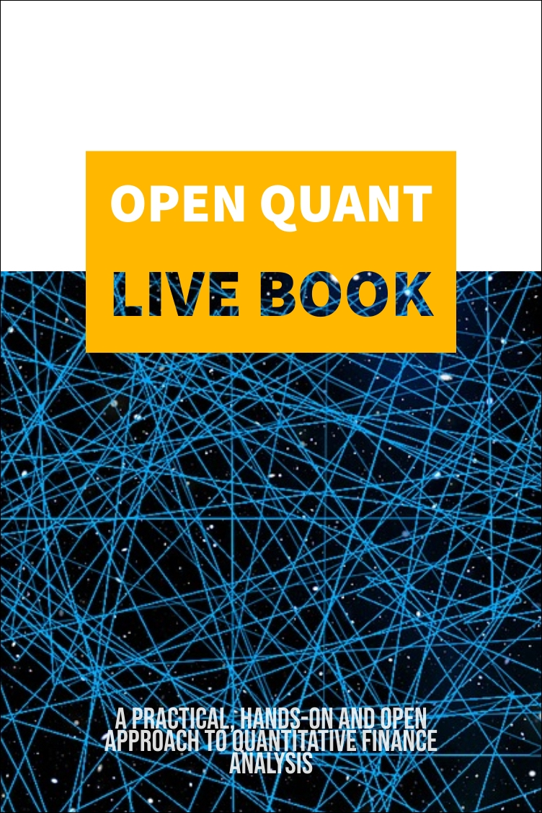

--- 
title: "The Open Quant Live Book"
author: "Thársis T. P. Souza"
date: "`r Sys.Date()`"
output: bookdown::gitbook
site: bookdown::bookdown_site
documentclass: book
bibliography: [book.bib, packages.bib]
biblio-style: apalike
link-citations: yes
colorlinks: yes
links-as-notes: true
toc_depth: 3
toc_unnumbered: no
toc_appendix: yes
github-repo: souzatharsis/open-quant-live-book
cover-image: ./fig/cover1.jpg
description: "The Open Quant Live Book"
---


```{r include=FALSE}
source("./chapters/util.R")
```

```{r include = FALSE}
if(!knitr:::is_html_output())
{
  options("width"=56)
  knitr::opts_chunk$set(tidy.opts=list(width.cutoff=56, indent = 2), tidy = TRUE)
  knitr::opts_chunk$set(fig.pos = 'H')
}
```

# Preface {-}




### Working Contents {-}

1. The Basics

+ I/O
+ Stylized Facts
+ Correlation & Causation

2. Algo Trading   

+ Investment Process
+ Backtesting
+ Factor Investing
+ Limit Order

3. Portfolio Optimization

+ Modern Portfolio Theory
+ Measuring Risk
+ Linear Programming

4. Machine Learning

+ Intro
+ AutoML
+ Hierarchical Risk Parity

5. Econophysics

+ Entropy, Efficiency and Coupling
+ Transfer Entropy, Information Transfer and Causality
+ Financial Networks

### Contribute {-}

The Book is [Open](https://github.com/souzatharsis/open-quant-live-book) and we are looking for co-authors (as I will never have the time or the knowledge to write it all by myself). Feel free to [reach out](http://www.souzatharsis.com/) or simply create a pull request with your contribution on our [Github project](https://github.com/souzatharsis/open-quant-live-book).


### Book's information {-}

First published at: [openquant.netlify.com](https://openquant.netlify.com/).

Licensed under [Attribution-NonCommercial-ShareAlike 4.0 International](https://creativecommons.org/licenses/by-nc-sa/4.0/). 

```{r echo=FALSE, out.width='20%'}

```

```{block2, type='flushright', html.tag='p'}
Copyright (c) 2018. Thársis T. P. Souza. New York, NY.
```


```{r include=FALSE}
# automatically create a bib database for R packages
knitr::write_bib(c(
  .packages(), 'bookdown', 'knitr', 'rmarkdown'
), 'packages.bib')
```
